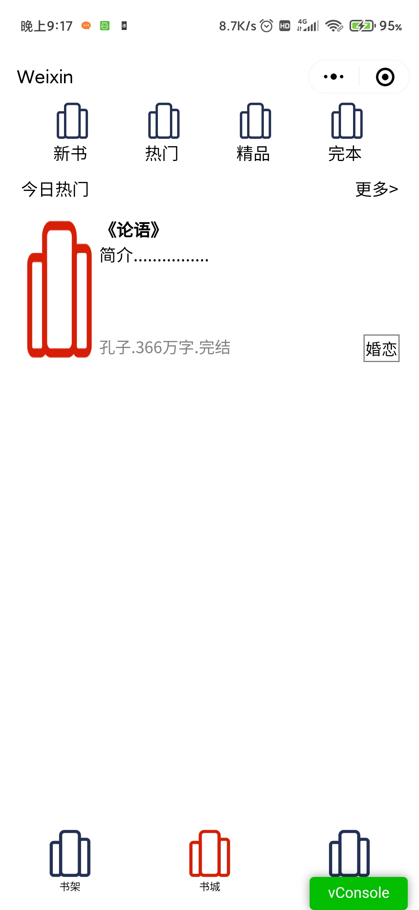
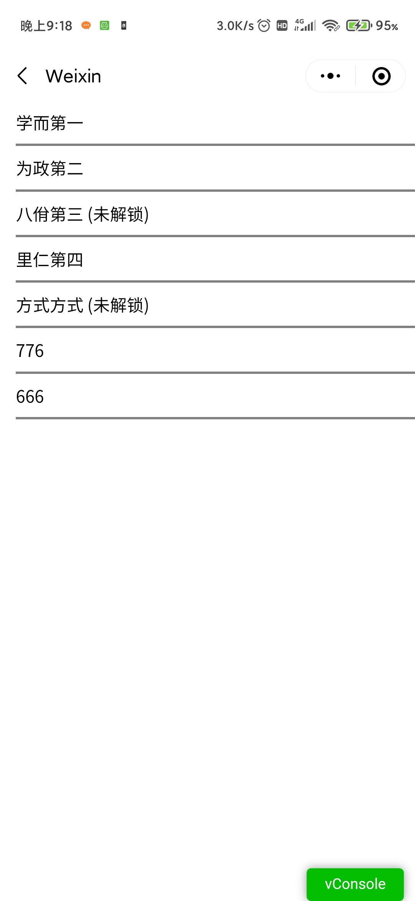
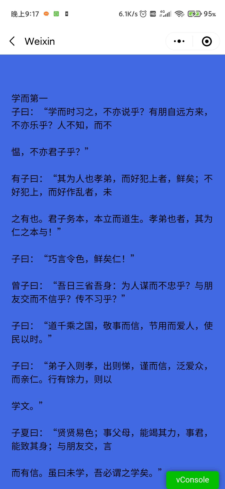
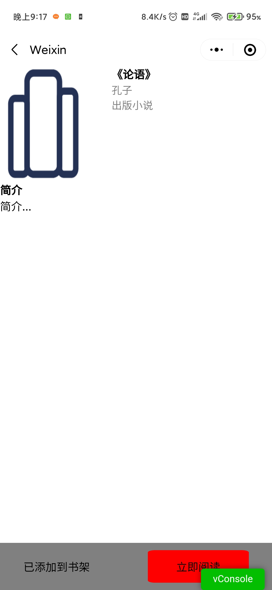
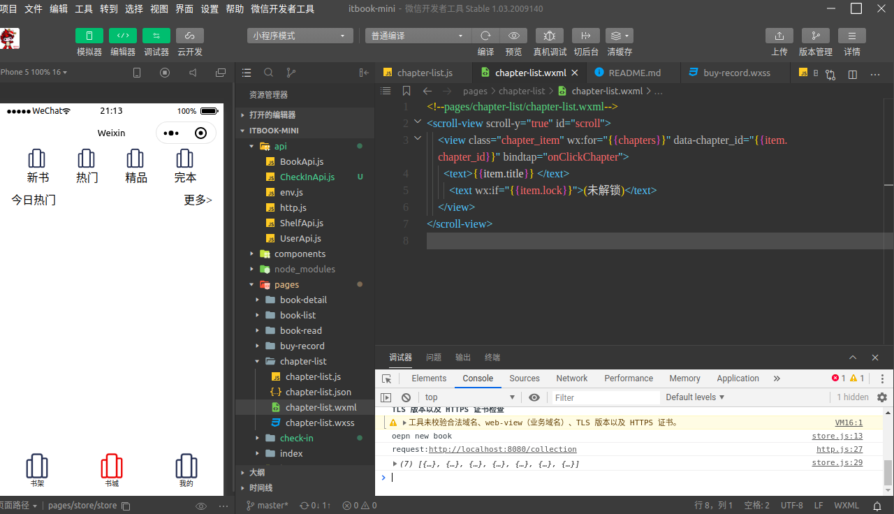
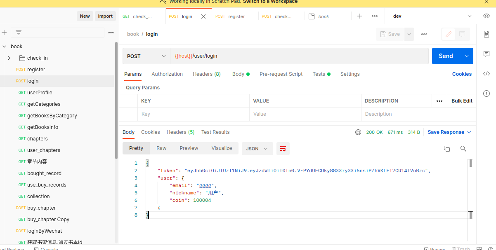
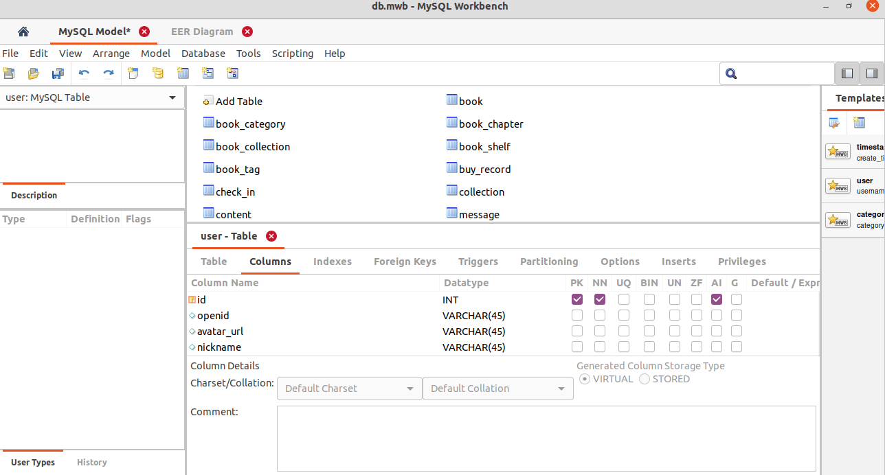

## 小程序在线书城

技术栈: SpringBoot + Mybatis + MYSQL , 微信小程序 

- 书城API接口：https://gitee.com/FormatFa/it_book
- 书城小程序： https://gitee.com/FormatFa/itbook_mini
- 书本后台管理(基于若依管理系统): https://gitee.com/FormatFa/it_book_manage

实现功能:
- [x] 书本列表
- [x] 书本收藏
- [x] 书本阅读  
- [x] 微信登录
- [x] 购买章节

TOOD:
- [ ] 后台分类管理
## 预览

## Quickly Start
### 导入IDEA启动
- 设置微信小程序环境变量(不启动小程序可跳过)
  - export WECHAT_MINI_APPID=xxx
  - export WECHAT_MINI_SECRET=yyy
#### 1. 导入mysql数据
创建数据库book,导入初始表结构(sql文件位于./deploy/db/book_api_table_init.sql)
#### 2. 配置application.properties
配置数据库的连接信息
#### 3. 启动ItbookApplication
### 4. 导入测试数据
位于doc/db/下有测试书本数据
### Docker-Compose
修改环境变量(设置微信小程序appid和secret key)：
vi deploy/docker/book_api_server.env
执行:
docker-compose up -d

## 开发工具
### Postman 测试api
可以使用Postman导入doc/api/book.postman_collection.json的api数据，
来调试接口

### 数据库结构模型
数据库结构使用MYSQL Workbench创建，文件位于doc/db.mwb，在Workbench
中可以直接打开

在workbench修改模型后，可以使用里面的同步功能，将修改同步(菜单栏中Database->Synchronize Model)到数据库中
不需要手动修改表结构